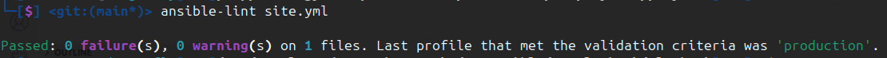
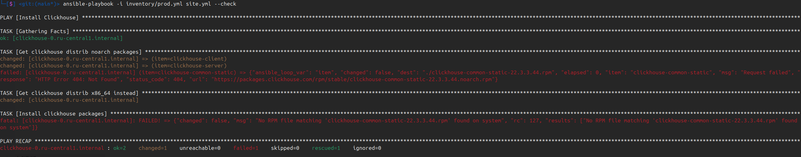
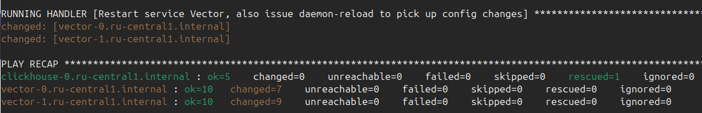
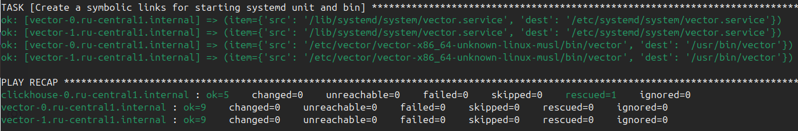
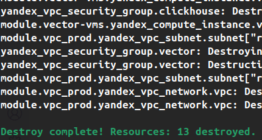

# Домашнее задание к занятию 2 «Работа с Playbook»

## Задание 1 (основная часть)

1. Подготовьте свой inventory-файл `prod.yml`.

> Для подготовки окружения использовался [terraform](./terraform) с модулями, в результате динамически
> формируется inventory [prod.yml](playbook/inventory/prod.example.yml) по шаблону [inventory.tftpl](terraform/inventory.tftpl).  
> Clickhouse будет ставиться на отдельную ВМ, Vector на две другие ВМ.

2. Допишите playbook: нужно сделать ещё один play, который устанавливает и настраивает [vector](https://vector.dev). 
Конфигурация vector должна деплоиться через template файл jinja2. От вас не требуется использовать все возможности шаблонизатора, 
просто вставьте стандартный конфиг в template файл. 
Информация по шаблонам по [ссылке](https://www.dmosk.ru/instruktions.php?object=ansible-nginx-install).

3. При создании tasks рекомендую использовать модули: `get_url`, `template`, `unarchive`, `file`.

4. Tasks должны: скачать дистрибутив нужной версии, выполнить распаковку в выбранную директорию, установить vector.

> Добавлен play "Install Vector" в [плейбук](playbook/playbook.yml). Предусмотрена идемпотентность и следование основным правилам линтера.

5. Запустите `ansible-lint site.yml` и исправьте ошибки, если они есть.

6. Попробуйте запустить playbook на этом окружении с флагом `--check`.

> Запуск `check` ожидаемо сломался на стадии "Install clickhouse packages", т.к. таски здесь изменений не выполняют, а значит и .rpm-пакетов для инсталляции на таргет-хосте не существует.

7. Запустите playbook на `prod.yml` окружении с флагом `--diff`. Убедитесь, что изменения на системе произведены.

> Сервисы запущены, Vector законнектился к Clickhouse

8. Повторно запустите playbook с флагом `--diff` и убедитесь, что playbook идемпотентен.

> Recap повторного запуска показал, что изменений не было, а значит, идемпотентность соблюдена:

9. Подготовьте README.md-файл по своему playbook. В нём должно быть описано: что делает playbook, какие у него есть параметры и теги. 
Пример качественной документации ansible playbook по [ссылке](https://github.com/opensearch-project/ansible-playbook).

[README.md](playbook/README.md)

> удаление ресурсов из облака 

