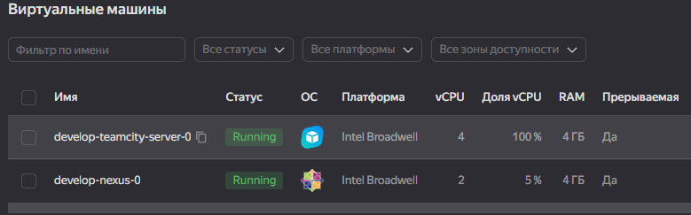
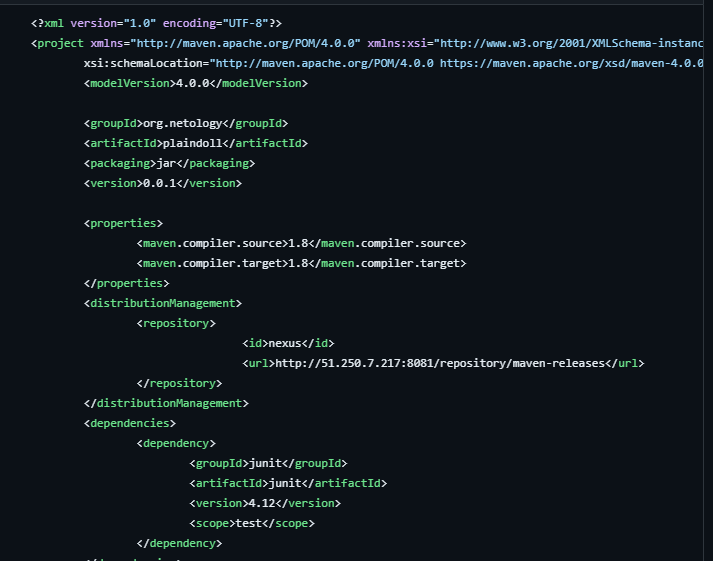
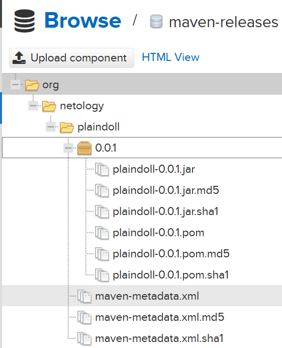
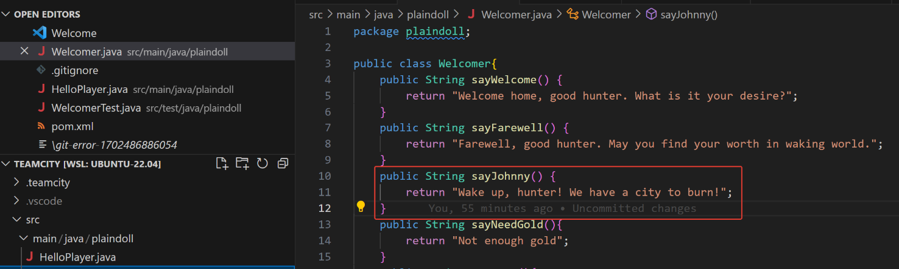
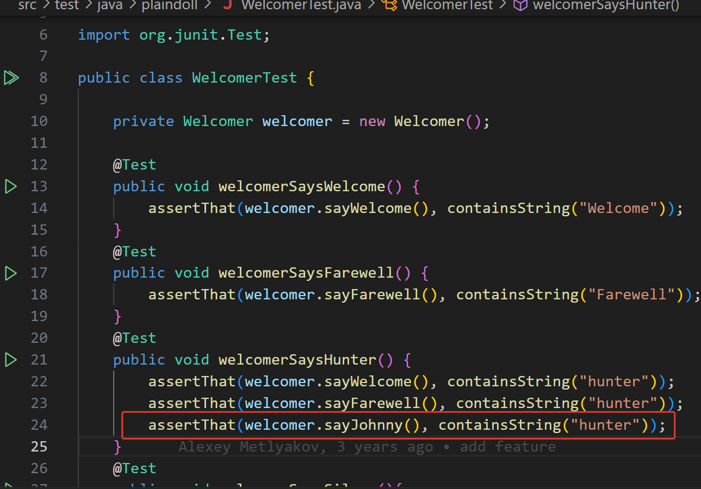
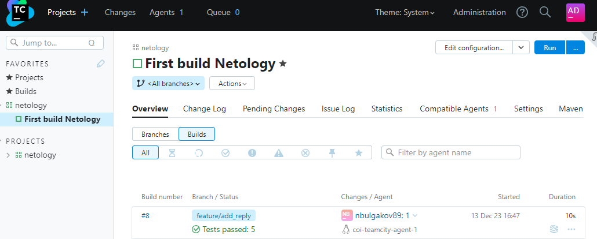
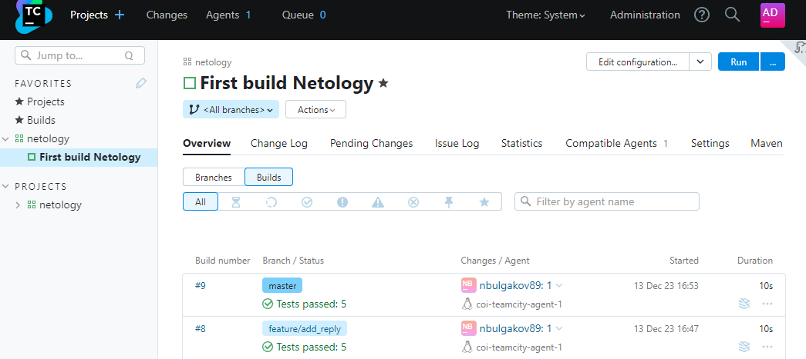
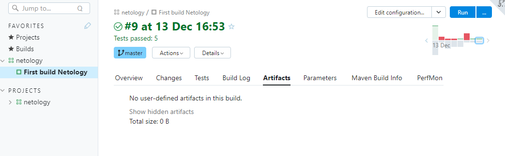
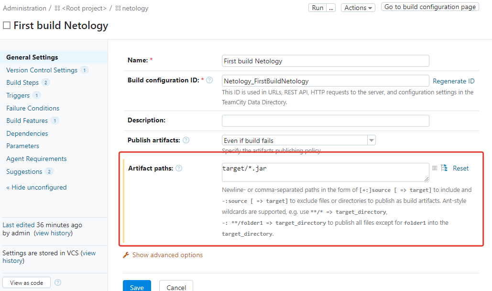
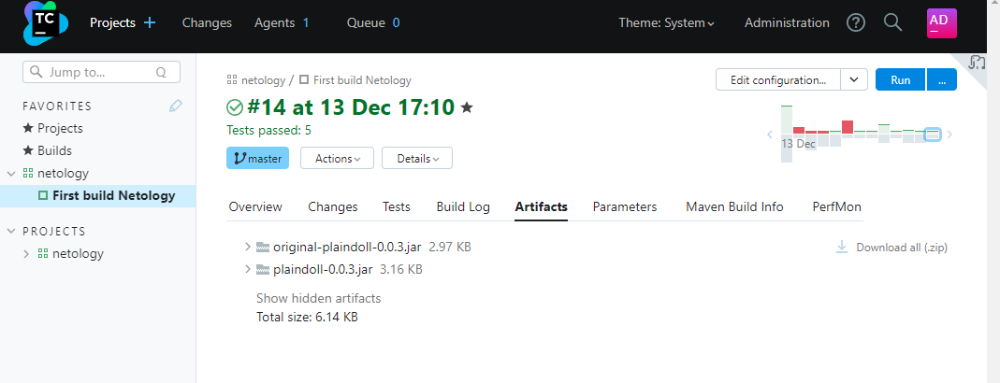

# Домашнее задание к занятию 11 «Teamcity»

**Решение:**

5. Для deploy будет необходимо загрузить `settings.xml` в набор конфигураций maven у teamcity, предварительно записав туда креды для подключения к nexus.

Взят settings.xml из репозитория, креды такие же

6. pom.xml - изменённые настройки

7. Артефакт в Nexus

8. Настройки сборки -> Version Control Settings (миграция сборки)

9. Создайте отдельную ветку `feature/add_reply` в репозитории.

10. `Wake up, hunter! We have a city to burn!`

11. Дополните тест для нового метода на поиск слова `hunter` в новой реплике.

12. Сделайте push всех изменений в новую ветку репозитория.

13. Запустились только тесты

14. Успешная сборка на мастере

15. Артефактов нет

16. Путь для артефактов

17. Проведите повторную сборку мастера, убедитесь, что сбора прошла успешно и артефакты собраны.

18. Проверьте, что конфигурация в репозитории содержит все настройки конфигурации из teamcity.

19. [example-teamcity](https://github.com/olyavoznuyk/example-teamcity)