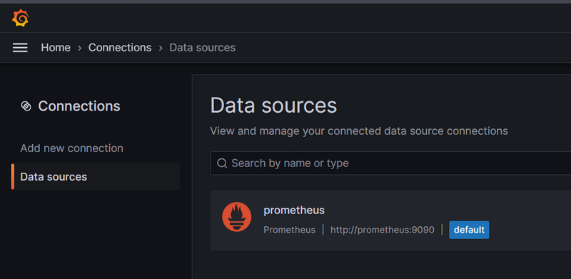
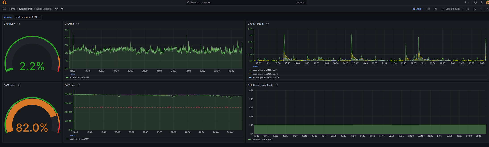
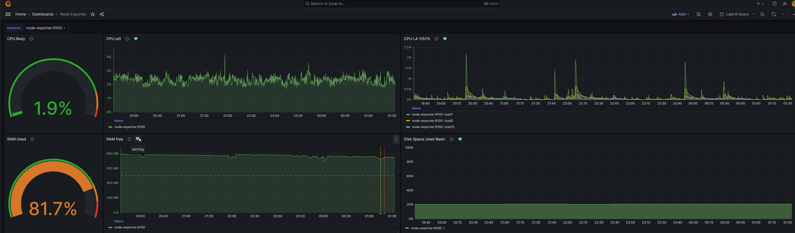

# Домашнее задание к занятию 14 «Средство визуализации Grafana»

## Задание повышенной сложности

**При решении задания 1** не используйте директорию [help](./help) для сборки проекта. Самостоятельно разверните grafana, где в роли источника данных будет выступать prometheus, а сборщиком данных будет node-exporter:

- grafana;
- prometheus-server;
- prometheus node-exporter.

За дополнительными материалами можете обратиться в официальную документацию grafana и prometheus.

В решении к домашнему заданию также приведите все конфигурации, скрипты, манифесты, которые вы 
использовали в процессе решения задания.

**При решении задания 3** вы должны самостоятельно завести удобный для вас канал нотификации, например, Telegram или email, и отправить туда тестовые события.

В решении приведите скриншоты тестовых событий из каналов нотификаций.

## Обязательные задания

### Задание 1

1. Используя директорию [help](./help) внутри этого домашнего задания, запустите связку prometheus-grafana.
1. Зайдите в веб-интерфейс grafana, используя авторизационные данные, указанные в манифесте docker-compose.
1. Подключите поднятый вами prometheus, как источник данных.
1. Решение домашнего задания — скриншот веб-интерфейса grafana со списком подключенных Datasource.

```
docker compose up -d  
[+] Running 5/5
 ✔ Network help_monitor-net    Created                                                                                                                                                   0.1s 
 ✔ Volume "help_grafana_data"  Created                                                                                                                                                   0.0s 
 ✔ Container nodeexporter      Started                                                                                                                                                   0.6s 
 ✔ Container prometheus        Started                                                                                                                                                   0.6s 
 ✔ Container grafana           Started                                                                                                                                                   0.8s 
┌─[avt548499@dragonfly] - [~]
└─[$] <git:(MNT-video)> docker ps 
CONTAINER ID   IMAGE                       COMMAND                  CREATED         STATUS         PORTS                                       NAMES
94dc2c6101a8   grafana/grafana:7.4.0       "/run.sh"                4 seconds ago   Up 3 seconds   0.0.0.0:3000->3000/tcp, :::3000->3000/tcp   grafana
eb8de3a6c90c   prom/prometheus:v2.24.1     "/bin/prometheus --c…"   4 seconds ago   Up 3 seconds   9090/tcp                                    prometheus
ee32ccdb92cf   prom/node-exporter:v1.0.1   "/bin/node_exporter …"   5 seconds ago   Up 3 seconds   9100/tcp                                    nodeexporter

```


## Задание 2

Изучите самостоятельно ресурсы:

1. [PromQL tutorial for beginners and humans](https://valyala.medium.com/promql-tutorial-for-beginners-9ab455142085).
1. [Understanding Machine CPU usage](https://www.robustperception.io/understanding-machine-cpu-usage).
1. [Introduction to PromQL, the Prometheus query language](https://grafana.com/blog/2020/02/04/introduction-to-promql-the-prometheus-query-language/).

Создайте Dashboard и в ней создайте Panels:

- утилизация CPU для nodeexporter (в процентах, 100-idle);
- CPULA 1/5/15;
- количество свободной оперативной памяти;
- количество места на файловой системе.

Для решения этого задания приведите promql-запросы для выдачи этих метрик, а также скриншот получившейся Dashboard.

> PormQL запросы:
> - утилизация CPU для node exporter (в процентах, 100-idle);
> ```
> 100 -(avg by (instance) (rate(node_cpu_seconds_total{mode="idle", instance="$instance"}[30s])) * 100)  
> ```
> - CPULA 1/5/15;
> ```
> avg by (instance) (node_load1{instance="$instance"})
> avg by (instance) (node_load5{instance="$instance"})
> avg by (instance) (node_load15{instance="$instance"})
> ```
> - количество свободной оперативной памяти;
> ```
> avg_over_time(node_memory_MemFree_bytes{instance="$instance"}[$__interval])
> ```
> - количество места на файловой системе.
> ```
> 100 - ((node_filesystem_avail_bytes{instance="$instance"} * 100) / node_filesystem_size_bytes{instance="$instance"})
> ```



## Задание 3

1. Создайте для каждой Dashboard подходящее правило alert — можно обратиться к первой лекции в блоке «Мониторинг».
1. В качестве решения задания приведите скриншот вашей итоговой Dashboard.



## Задание 4

1. Сохраните ваш Dashboard.Для этого перейдите в настройки Dashboard, выберите в боковом меню «JSON MODEL». Далее скопируйте отображаемое json-содержимое в отдельный файл и сохраните его.
1. В качестве решения задания приведите листинг этого файла.

[ссылка на файл](dash.json)

---

### Как оформить решение задания

Выполненное домашнее задание пришлите в виде ссылки на .md-файл в вашем репозитории.

---
