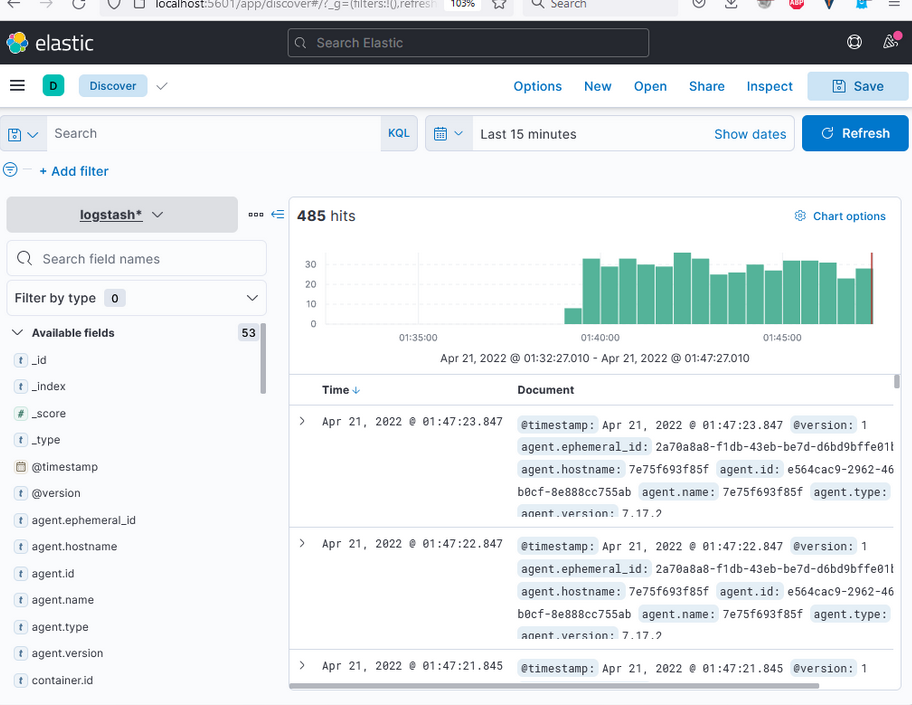
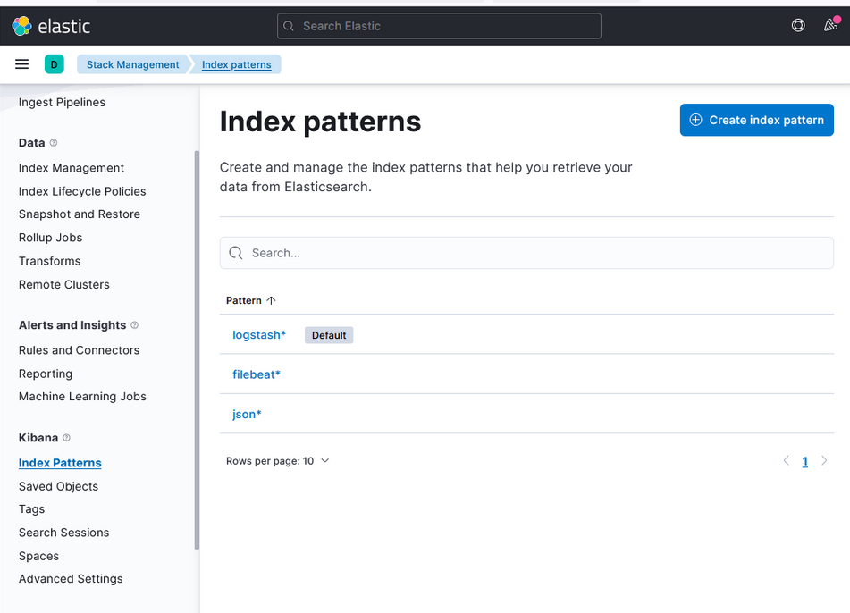
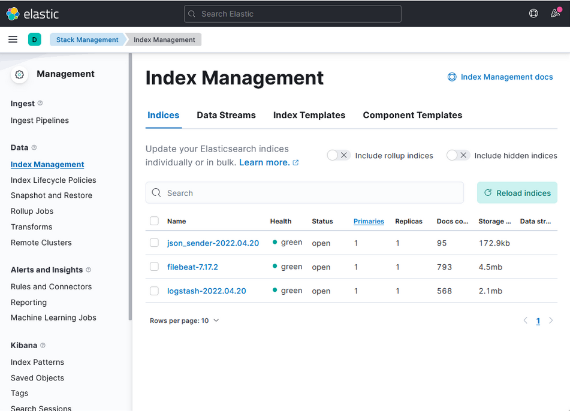

# Домашнее задание к занятию 15 «Система сбора логов Elastic Stack»

## Дополнительные ссылки

При выполнении задания используйте дополнительные ресурсы:

- [поднимаем elk в docker](https://www.elastic.co/guide/en/elastic-stack-get-started/current/get-started-docker.html);
- [поднимаем elk в docker с filebeat и docker-логами](https://www.sarulabs.com/post/5/2019-08-12/sending-docker-logs-to-elasticsearch-and-kibana-with-filebeat.html);
- [конфигурируем logstash](https://www.elastic.co/guide/en/logstash/current/configuration.html);
- [плагины filter для logstash](https://www.elastic.co/guide/en/logstash/current/filter-plugins.html);
- [конфигурируем filebeat](https://www.elastic.co/guide/en/beats/libbeat/5.3/config-file-format.html);
- [привязываем индексы из elastic в kibana](https://www.elastic.co/guide/en/kibana/current/index-patterns.html);
- [как просматривать логи в kibana](https://www.elastic.co/guide/en/kibana/current/discover.html);
- [решение ошибки increase vm.max_map_count elasticsearch](https://stackoverflow.com/questions/42889241/how-to-increase-vm-max-map-count).

В процессе выполнения в зависимости от системы могут также возникнуть не указанные здесь проблемы.

Используйте output stdout filebeat/kibana и api elasticsearch для изучения корня проблемы и её устранения.

## Задание повышенной сложности

Не используйте директорию [help](./help) при выполнении домашнего задания.

## Задание 1

Вам необходимо поднять в докере и связать между собой:

- elasticsearch (hot и warm ноды);
- logstash;
- kibana;
- filebeat.

Logstash следует сконфигурировать для приёма по tcp json-сообщений.

Filebeat следует сконфигурировать для отправки логов docker вашей системы в logstash.

В директории [help](./help) находится манифест docker-compose и конфигурации filebeat/logstash для быстрого 
выполнения этого задания.

Результатом выполнения задания должны быть:

- скриншот `docker ps` через 5 минут после старта всех контейнеров (их должно быть 5);
- скриншот интерфейса kibana;
- docker-compose манифест (если вы не использовали директорию help);
- ваши yml-конфигурации для стека (если вы не использовали директорию help).

* [свой компоуз](./my_help/docker-compose.yaml)

* [filebeat.yml](./my_help/filebeat/filebeat.docker.yml)

* [simple_config.conf](./my_help/logstash/pipeline/simple_config.conf)

```
docker ps 
CONTAINER ID   IMAGE                      COMMAND                  CREATED         STATUS         PORTS                                                                                                                                 NAMES
05b42dff734d   elastic/filebeat:7.17.2    "/usr/bin/tini -- /u…"   6 seconds ago   Up 4 seconds                                                                                                                                         filebeat
c5e6b53ed730   pycontribs/alpine:latest   "python3 /opt/run.py"    6 seconds ago   Up 4 seconds                                                                                                                                         some_app
f00112067f42   elasticsearch:7.17.2       "/bin/tini -- /usr/l…"   6 seconds ago   Up 4 seconds   0.0.0.0:9201->9200/tcp, :::9201->9200/tcp, 0.0.0.0:9301->9300/tcp, :::9301->9300/tcp                                                  es-warm
a77e4a4e2d3d   pycontribs/alpine:latest   "python3 /opt/gather…"   6 seconds ago   Up 4 seconds                                                                                                                                         json_sender
e852ab9c3e4c   elasticsearch:7.17.2       "/bin/tini -- /usr/l…"   6 seconds ago   Up 4 seconds   0.0.0.0:9200->9200/tcp, :::9200->9200/tcp, 0.0.0.0:9300->9300/tcp, :::9300->9300/tcp                                                  es-hot
5118a9d40b21   logstash:7.17.2            "/usr/local/bin/dock…"   6 seconds ago   Up 4 seconds   0.0.0.0:5044->5044/tcp, :::5044->5044/tcp, 0.0.0.0:9600->9600/tcp, :::9600->9600/tcp, 0.0.0.0:12345->12345/tcp, :::12345->12345/tcp   logstash
d3f31b5eb390   kibana:7.17.2              "/bin/tini -- /usr/l…"   6 seconds ago   Up 4 seconds   0.0.0.0:5601->5601/tcp, :::5601->5601/tcp                                                                                             kibana

```



## Задание 2

Перейдите в меню [создания index-patterns  в kibana](http://localhost:5601/app/management/kibana/indexPatterns/create) и создайте несколько index-patterns из имеющихся.

Перейдите в меню просмотра логов в kibana (Discover) и самостоятельно изучите, как отображаются логи и как производить поиск по логам.

В манифесте директории help также приведенно dummy-приложение, которое генерирует рандомные события в stdout-контейнера.
Эти логи должны порождать индекс logstash-* в elasticsearch. Если этого индекса нет — воспользуйтесь советами и источниками из раздела «Дополнительные ссылки» этого задания.





---

### Как оформить решение задания

Выполненное домашнее задание пришлите в виде ссылки на .md-файл в вашем репозитории.

---

 
