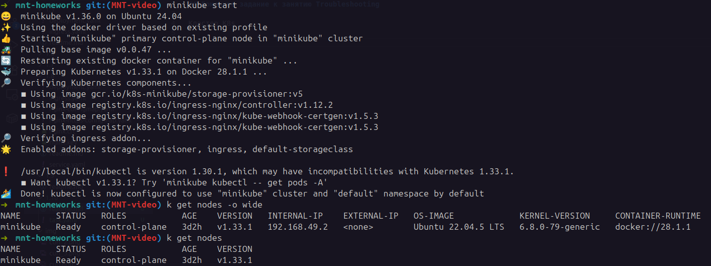
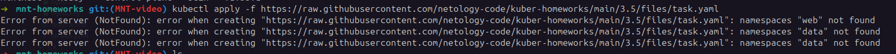
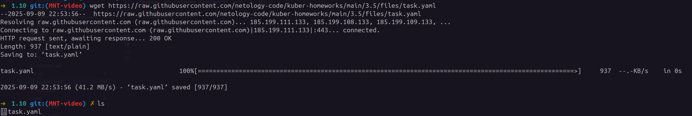
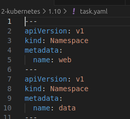
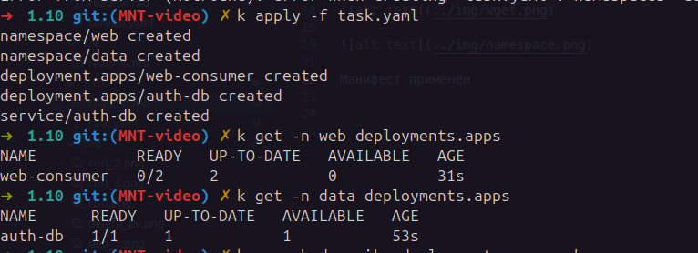
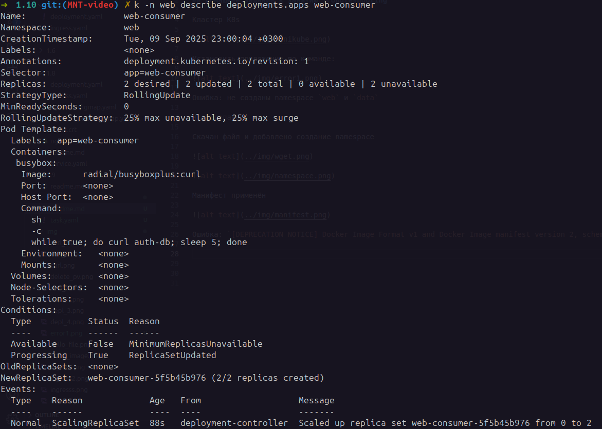
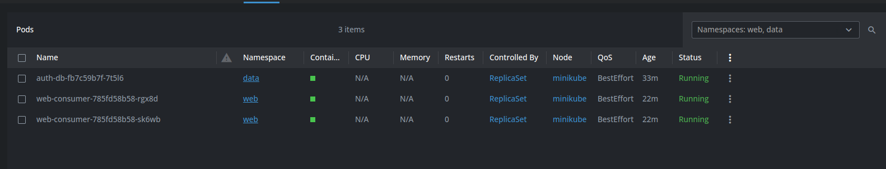

## Домашнее задание к занятию Troubleshooting

Кластер K8s



Установить приложение по команде:



Ошибка: не созданы namespace `web` и `data`

Что сделано:

Скачан файл и добавлено создание namespace





Манифест применён 



Ошибка: `[DEPRECATION NOTICE] Docker Image Format v1 and Docker Image manifest version 2, schema 1 support is disabled by default`



Меняем имадж на более актуальный 

```yaml
image: alpine/curl:8.14.1
```

Всё исправлено, результат работы:




