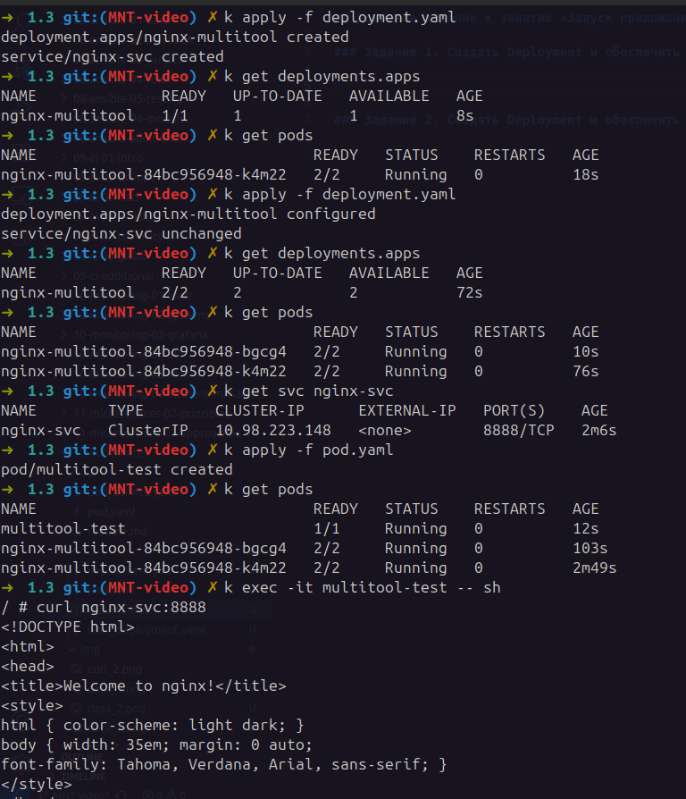
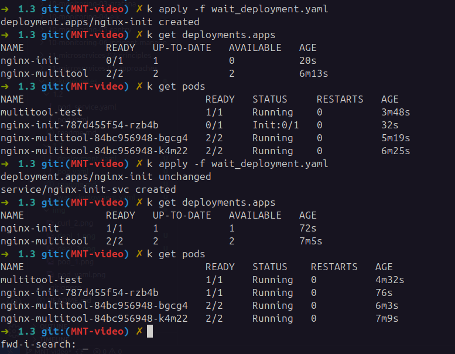

## Домашнее задание к занятию «Запуск приложений в K8S»

### Задание 1. Создать Deployment и обеспечить доступ к репликам приложения из другого Pod

### Задание 2. Создать Deployment и обеспечить старт основного контейнера при выполнении условий

