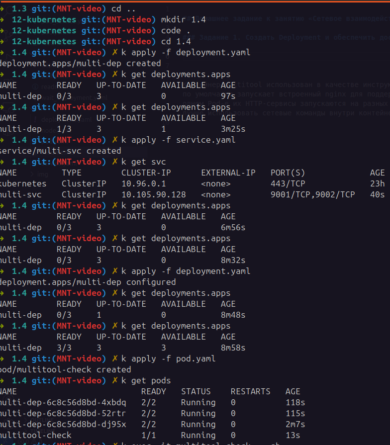
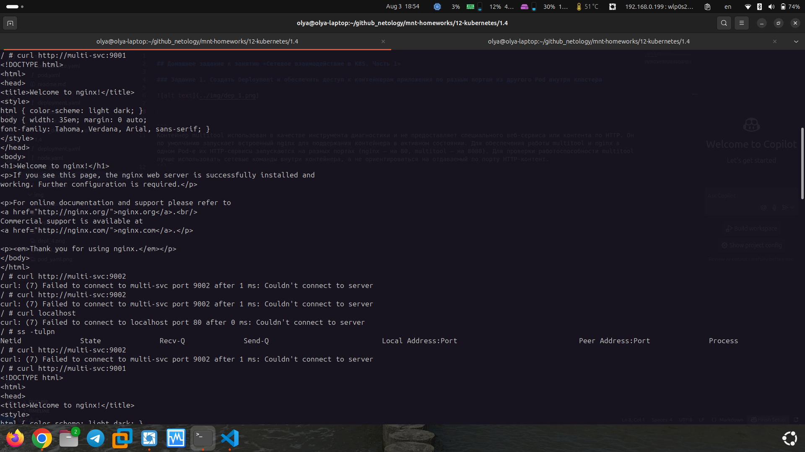
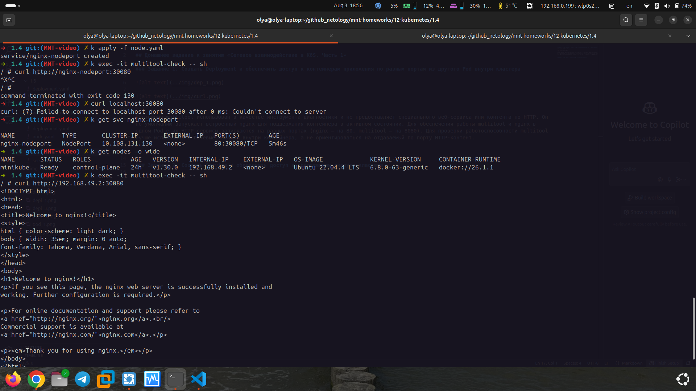

## Домашнее задание к занятию «Сетевое взаимодействие в K8S. Часть 1»

### Задание 1. Создать Deployment и обеспечить доступ к контейнерам приложения по разным портам из другого Pod внутри кластера





```
Контейнер multitool использован в качестве инструмента диагностики и не предоставляет специального веб-сервиса или контента по HTTP. Он по умолчанию запускает встроенный nginx для поддержания контейнера в активном состоянии. Для обеспечения работы multitool и nginx в одном Pod-е их HTTP-сервисы запускаются на разных портах (nginx — на 80, multitool — на 8080). Для проверки работоспособности multitool лучше использовать сетевые команды внутри контейнера, а не ориентироваться на отдаваемый по порту HTTP-контент.
```


### Задание 2. Создать Service и обеспечить доступ к приложениям снаружи кластера

