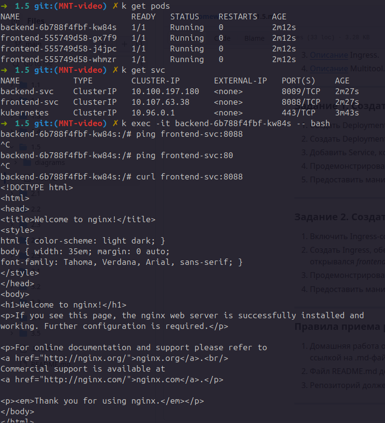
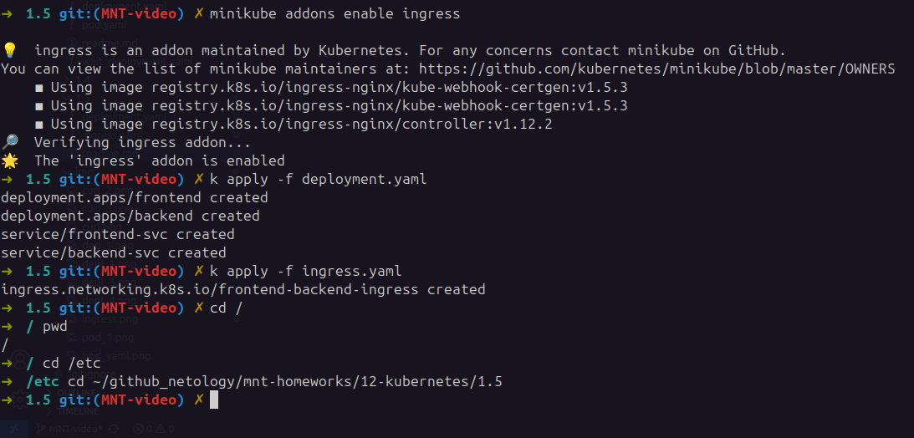
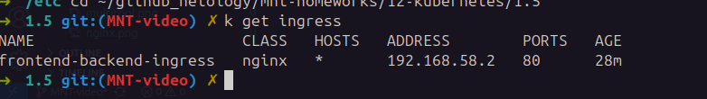
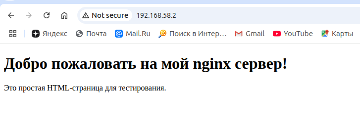
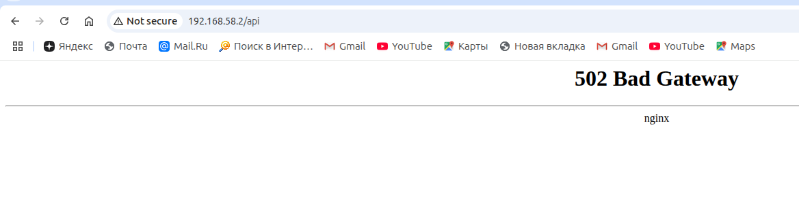

### Домашнее задание к занятию «Сетевое взаимодействие в K8S. Часть 2»

## Задание 1. Создать Deployment приложений backend и frontend

## Задание 2. Создать Ingress и обеспечить доступ к приложениям снаружи кластера

> страница не отображается, т.к. в образе нет index.html