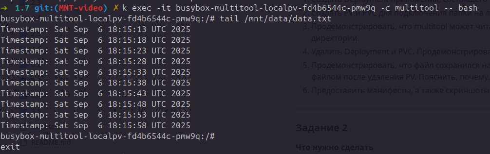
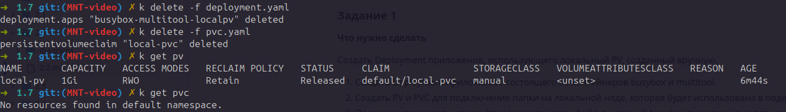
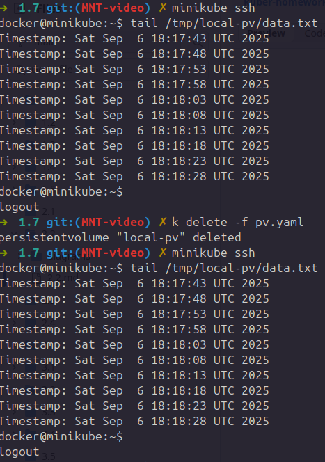
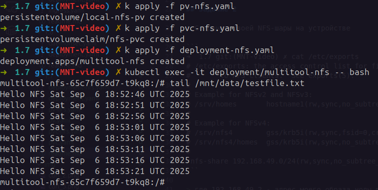
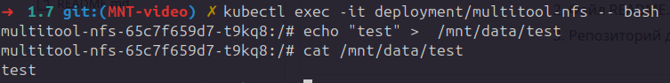

### Домашнее задание к занятию «Хранение в K8s. Часть 2»

## Задание 1

* Продемонстрировать, что multitool может читать файл, в который busybox пишет каждые пять секунд в общей директории.



* Удалить Deployment и PVC. Продемонстрировать, что после этого произошло с PV. Пояснить, почему.



> PV в состоянии Retain НЕ удалится автоматически — он останется в Kubernetes в статусе Released, но данные на диске сохранятся.

* Продемонстрировать, что файл сохранился на локальном диске ноды. Удалить PV. Продемонстрировать что произошло с файлом после удаления PV. Пояснить, почему.



> При удалении PV локальные данные НЕ удаляются автоматически, так как это локальный том, и Kubernetes не управляет физическим хранилищем напрямую. Удаление PV убирает его из Kubernetes, но не затрагивает физический диск и файлы на нем.

## Задание 2

* Создание своей NFS-шары на устройстве

```
➜  1.7 git:(MNT-video) ✗ cat /etc/exports                
# /etc/exports: the access control list for filesystems which may be exported
#		to NFS clients.  See exports(5).
#
# Example for NFSv2 and NFSv3:
# /srv/homes       hostname1(rw,sync,no_subtree_check) hostname2(ro,sync,no_subtree_check)
#
# Example for NFSv4:
# /srv/nfs4        gss/krb5i(rw,sync,fsid=0,crossmnt,no_subtree_check)
# /srv/nfs4/homes  gss/krb5i(rw,sync,no_subtree_check)
#
/nfs-share 192.168.49.0/24(rw,sync,no_subtree_check)
```

> где 192.168.49.2 - адрес моего образа ноды minikube - разрешаем подключение к шаре

* Монтируем к миникуб шару, всё отрабатывает

```
➜  1.7 git:(MNT-video) ✗ minikube ssh                            
docker@minikube:~$ sudo mount -t nfs 192.168.0.199:/nfs-share /mnt
docker@minikube:~$ 
```

* Продемонстрировать возможность чтения и записи файла изнутри пода.

> файл записи из манифеста



> ручная запись\чтение

