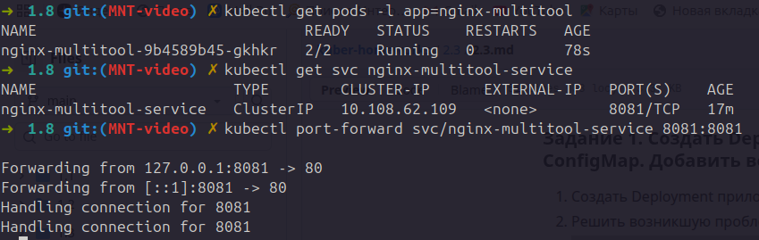
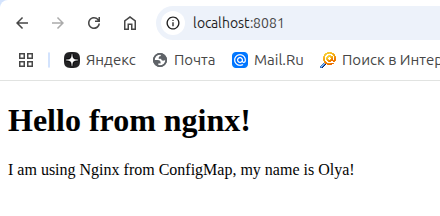
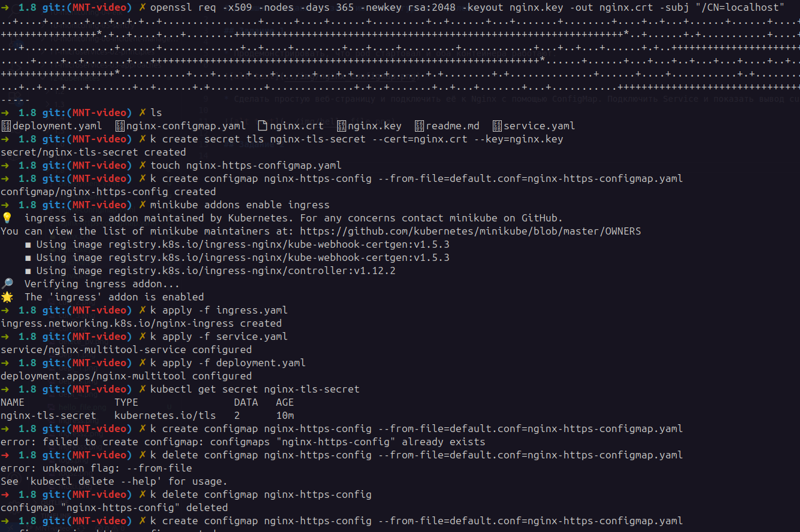
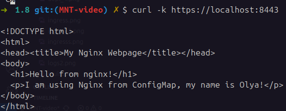

# Домашнее задание к занятию «Конфигурация приложений»

## Задание 1 

* Продемонстрировать, что pod стартовал и оба контейнера работают.

* Сделать простую веб-страницу и подключить её к Nginx с помощью ConfigMap. Подключить Service и показать вывод curl или в браузере.

## Задание 2

* файлы манифестов дополнены

* Скриншоты выполнения

